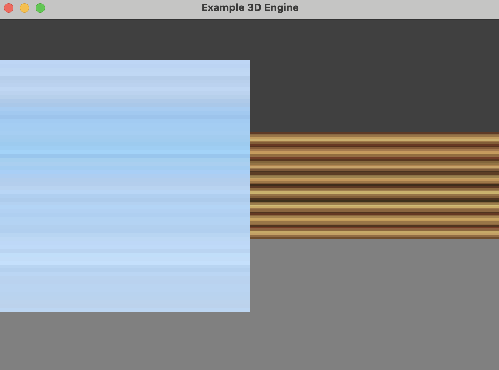

# Raykasting

This project is an implementation of Ray Casting technique based
on [this simple tutorial](https://www.instructables.com/Making-a-Basic-3D-Engine-in-Java/) using the Kotlin language.

It does not work well, It is very slow and not respond immediately.

Textures inside the resources folder are from [opengameart.org](https://opengameart.org/content/64x-textures-an-overlays)
